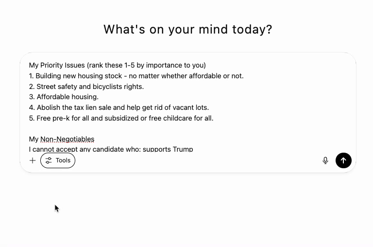

  
Quick facts about voting

# NYC Mayoral Primary Quick Guide

**Key Links:** [Find your polling place](https://findmypollsite.vote.nyc/) | [Register to vote](https://e-register.vote.nyc/) | [Check registration](https://amiregistered.vote.nyc/) | [Request mail ballot](https://requestballot.vote.nyc/)

• **When:** Early voting June 14-22, Primary Day June 24. [Check hours here](https://www.vote.nyc/elections)

• **Who can vote:** Must be registered Democrat (Republicans/unaffiliated can't vote in Dem primary). Deadline to register was June 14.

• **Where:** [Look up your polling location](https://findmypollsite.vote.nyc/) - early voting location may differ from Primary Day

• **How:** Ranked-choice voting - rank up to 5 candidates in order of preference. **Read below for a quick prompt for researching and building your ballot with an AI Deep Research query.**

# Deep Research Prompt to help choose your candidates for mayor
The goal of the prompt below is to allow you to quickly and easily find a slate of ranked choice candidates that expresses your political preferences. 

## Instructions

Fill out the following two sections and then copy/paste into your Deep Research AI tool of choice (e.g. [ChatGPT Deep Research](https://openai.com/index/introducing-deep-research/).)

## Your Information (Fill This Out First)

### My Priority Issues (rank these 1-5 by importance to you)

1. **[Issue Name]** - My position: [your specific stance] - Deal-breaker level: [High/Medium/Low]
2. **[Issue Name]** - My position: [your specific stance] - Deal-breaker level: [High/Medium/Low]
3. **[Issue Name]** - My position: [your specific stance] - Deal-breaker level: [High/Medium/Low]
4. **[Issue Name]** - My position: [your specific stance] - Deal-breaker level: [High/Medium/Low]
5. **[Issue Name]** - My position: [your specific stance] - Deal-breaker level: [High/Medium/Low]

### My Non-Negotiables

- I cannot accept any candidate who: [specific positions or actions you cannot support]
- Automatic disqualifiers: [any scandals, endorsements, or behaviors that eliminate a candidate]

### My Voting Strategy Preferences _(change these defaults if you prefer a different approach)_

- **Electability vs. Perfect Match**: Balanced approach - prioritize candidates who both align with my values AND have a realistic chance of winning
- **Risk Tolerance**: Focus primarily on viable candidates, but include 1-2 long-shot candidates if they strongly match my values
- **Representation Priorities**: No specific requirements, but consider diversity of experience and background as a positive tie-breaker

### Tie-Breakers _(change these defaults if you have stronger preferences)_

- Slight preference for candidates who: have executive experience, build broad coalitions, and have endorsements from organizations I trust

---

## Instructions for AI

NYC's 2025 Mayoral Democratic Primary uses ranked choice voting. Research all eligible candidates and create a strategic ranked choice ballot that matches the user's preferences above.

### Research Requirements

- Use only current, verified information from 2024-2025
- Cross-reference candidate positions from multiple sources
- Include recent polling data and key endorsements
- Note any recent position changes or controversies
- Assess each candidate's realistic chances of winning

### Strategic Considerations Required

- **Electability Assessment**: Which candidates have realistic paths to victory?
- **Coalition Building**: Should any candidates be ranked higher for strategic reasons?
- **Ranked Choice Strategy**: How does the elimination process affect optimal ranking?
- **Spoiler Prevention**: How to avoid inadvertently helping least-preferred candidates?

---

## REQUIRED RESPONSE FORMAT (START WITH THIS)

### 🗳️ YOUR RECOMMENDED RANKED CHOICE BALLOT

1. **[Candidate Name]** - One sentence explaining why they're ranked here based on issues + strategy
2. **[Candidate Name]** - One sentence explaining why they're ranked here based on issues + strategy
3. **[Candidate Name]** - One sentence explaining why they're ranked here based on issues + strategy
4. **[Candidate Name]** - One sentence explaining why they're ranked here based on issues + strategy
5. **[Candidate Name]** - One sentence explaining why they're ranked here based on issues + strategy

_[Continue ranking ALL viable candidates - do not rank fewer than 5 candidates unless fewer are running]_

### 📊 STRATEGIC SUMMARY

- **Top Choice Reasoning**: [Why this candidate best matches preferences + electability]
- **Key Strategic Considerations**: [How ranked choice dynamics affected these rankings]
- **Risk Assessment**: [What could go wrong with this ballot strategy]

### 📋 DETAILED CANDIDATE ANALYSIS

**[Candidate 1 Name]**

- Position alignment with your priorities: [detailed breakdown]
- Electability assessment: [polling, endorsements, fundraising, organization]
- Strategic considerations: [how they fit in ranked choice dynamics]

**[Candidate 2 Name]** [Same format for each candidate]

### ✅ FINAL CHECKLIST

Before submitting your ballot, confirm:

- [ ]  You've ranked at least 5 candidates (if available)
- [ ]  Your rankings consider both issue alignment AND electability
- [ ]  You understand how your lower choices could matter in elimination rounds
- [ ]  No non-negotiable deal-breakers appear on your ballot

# Sources

https://www.nytimes.com/2025/06/14/nyregion/early-voting-nyc-mayor-election.html
